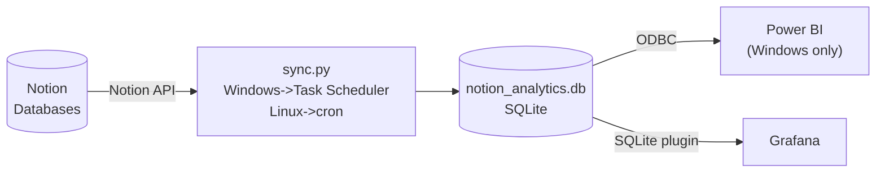

# Notion Analytics

[](LICENSE)

Notion is built for managing information, not analyzing it. Notion Analytics pulls your Notion databases into a local SQLite file on a schedule, enabling dashboards in Power BI or Grafana — with a full field-level change history so you can see exactly how your data evolved over time.

## Architecture



## Features

- **Scheduled sync** — runs via Task Scheduler (Windows) or cron / systemd (Linux)
- **Field-level change tracking** — every property change recorded with timestamps; full history of how your data evolved
- **Auto-schema evolution** — new Notion columns appear automatically on the next sync, no manual migration
- **Content and comment sync** — page body and comments captured as plain text
- **Property rename support** — declare a rename in config, change history migrated automatically
- **CSV export** — optional alongside SQLite
- **Cross-platform** — Windows and Linux both supported

## Table of Contents

- [Quick Start](#quick-start)
- [Setup](#setup)
  - [Full Setup](#full-setup)
  - [Running the Sync](#running-the-sync)
  - [Scheduling](#scheduling)
  - [Connecting to Power BI](#connecting-to-power-bi)
  - [Connecting to Grafana](#connecting-to-grafana)
  - [Verifying the Database](#verifying-the-database)
- [Guide](#guide)
  - [Change Tracking](#change-tracking)
  - [Content Sync](#content-sync)
  - [Usage Tips](#usage-tips)
- [Reference](#reference)
  - [SQLite Table Structure](#sqlite-table-structure)
  - [Property Types](#property-types)
  - [Handling Schema Changes](#handling-schema-changes)
  - [Resetting the Database](#resetting-the-database)
- [Updating](#updating)
- [Troubleshooting](#troubleshooting)
- [Known Limitations](#known-limitations)
- [Planned Features](#planned-features)
- [Dependencies & Related Projects](#dependencies--related-projects)
- [License](#license)
- [Credits](#credits)

---

## Quick Start

```bash
git clone https://github.com/DreamShark-Bytes/Notion_Analytics.git
cd Notion_Analytics
python -m venv venv

# Linux / macOS
venv/bin/pip install -r requirements.txt

# Windows
venv\Scripts\pip install -r requirements.txt
```

Copy and configure:

```bash
cp config_example.toml config.toml
# Edit config.toml: add your Notion token and at least one database ID
```

Run:

```bash
venv/bin/python sync.py     # Linux / macOS
venv\Scripts\python sync.py    # Windows
```

Your data is now in `notion_analytics.db`. Open it in [DB Browser for SQLite](https://sqlitebrowser.org/) to verify, then connect Power BI or Grafana.

---

## Setup

### Full Setup

#### 1. Create your Notion integration

1. Go to [notion.so/my-integrations](https://www.notion.so/my-integrations)
2. Click **New integration**, give it a name, select your workspace
3. Copy the **Internal Integration Secret**
4. For each database you want to sync: open the database in Notion → `...` menu → **Connect to** → select your integration

#### 2. Configure

```bash
cp config_example.toml config.toml
```

Find each database ID in its Notion URL: `https://notion.so/workspace/**{database-id}**?v=...`

```toml
token = "ntn_your_token_here"

[[databases]]
id = "your-database-id-here"
name = "tasks"                # table prefix in SQLite — no spaces, lowercase
include_content = true        # include page body as plain text
include_comments = true       # include page comments
track_changes = true          # record field-level change history
```

See `config_example.toml` for all available options.

### Running the Sync

```bash
# One-shot sync
venv/bin/python sync.py                               # Linux
venv\Scripts\python sync.py                           # Windows

# Use a different config file
venv/bin/python sync.py --config config_test.toml

# Full refresh — re-fetches all pages (useful after config changes)
venv/bin/python sync.py --full
```

Output: `notion_analytics.db` (SQLite), optionally `exports/` (CSV), log at `notion_analytics.log`.

### Scheduling

#### Windows — Task Scheduler

1. Open **Task Scheduler** → **Create Task** (not "Create Basic Task")
2. **General tab:** Name: `Notion Analytics Sync` · Description: `Syncs Notion databases to a local SQLite file for use with Power BI and Grafana.`
3. **Triggers tab:** New → On a schedule → Daily → check **Repeat task every: 1 hour** for duration **Indefinitely**
4. **Actions tab:** New → Start a program
   - **Program/script:** `C:\Users\YourName\Documents\Notion_Analytics\venv\Scripts\python.exe`
   - **Add arguments:** `sync.py`
   - **Start in:** `C:\Users\YourName\Documents\Notion_Analytics`
5. **Conditions tab:** uncheck "Start the task only if the computer is on AC power" if on battery
6. **Settings tab:** check "If the task is already running, do not start a new instance"
7. Click OK → right-click the task → **Run** once → check `notion_analytics.log`

#### Linux — cron

```bash
crontab -e
```

Add (runs every hour):

```
0 * * * * cd /home/vince/Documents/Notion_Analytics && /home/vince/Documents/Notion_Analytics/venv/bin/python sync.py >> notion_analytics.log 2>&1
```

#### Linux — systemd timer

Create `/etc/systemd/system/notion-analytics.service`:

```ini
[Unit]
Description=Notion Analytics sync

[Service]
Type=oneshot
WorkingDirectory=/home/vince/Documents/Notion_Analytics
ExecStart=/home/vince/Documents/Notion_Analytics/venv/bin/python sync.py
User=vince
```

Create `/etc/systemd/system/notion-analytics.timer`:

```ini
[Unit]
Description=Run Notion Analytics sync hourly

[Timer]
OnBootSec=1min
OnUnitActiveSec=1h

[Install]
WantedBy=timers.target
```

```bash
sudo systemctl daemon-reload
sudo systemctl enable --now notion-analytics.timer
```

### Connecting to Power BI

#### Step 1 — Install the SQLite ODBC driver

Download and install the [SQLite ODBC driver](http://www.ch-werner.de/sqliteodbc/) (`sqliteodbc_w64.exe` for 64-bit Windows).

#### Step 2 — Create a DSN and connect Power BI Desktop

1. Open **ODBC Data Sources (64-bit)** — use the 64-bit version (search "ODBC" in Start)
2. **System DSN** tab → **Add** → select **SQLite3 ODBC Driver**
3. Name the DSN (e.g. `NotionAnalytics`) and set the database path to your `notion_analytics.db` file
4. In Power BI Desktop → **Get Data** → **ODBC** → select your DSN → load the tables

> **Tip:** Set the **Data Category** of the `url` column to **Web URL** in Power BI to make Notion page links clickable in reports.

**Alternative — CSV export (no driver needed)**

Set `export_csv = true` under `[output]` in `config.toml`. After each sync, CSV files appear in `exports/`. In Power BI Desktop → **Get Data** → **Text/CSV**.

#### Step 3 — Remote access

**Option A — Remote Desktop (RDP):** Enable Remote Desktop on your Windows machine and connect via Microsoft Remote Desktop (iOS/Android). [Tailscale](https://tailscale.com/) (free personal tier) makes the machine reachable from anywhere without port forwarding.

**Option B — Power BI Service:** Publish reports to the cloud and view them in Power BI Mobile. Requires a work or school Microsoft account — personal accounts are not supported. If you have one, sign in to Power BI Desktop → **File → Publish → Publish to Power BI**. For automatic cloud refresh without manually republishing, install the [On-Premises Data Gateway](https://powerbi.microsoft.com/en-us/gateway/) (Personal mode, free) on the same machine.

### Connecting to Grafana

[Grafana](https://grafana.com/oss/grafana/) (free, open-source) is a cross-platform alternative to Power BI that connects directly to SQLite.

1. Install Grafana: [grafana.com/docs/grafana/latest/setup-grafana/installation/](https://grafana.com/docs/grafana/latest/setup-grafana/installation/)
2. Install the SQLite plugin: **Administration → Plugins** → search `SQLite` → install
3. Add a data source: **Connections → Data sources → Add → SQLite** → set the path to your `notion_analytics.db`
4. Build dashboards with SQL queries against `_pages`, `_changes`, and `_comments` tables

Grafana runs as a service and is accessible from any browser — reachable remotely via [Tailscale](https://tailscale.com/) without port forwarding.

### Verifying the Database

After the first sync:

```bash
# Linux / macOS
sqlite3 notion_analytics.db ".tables"
sqlite3 notion_analytics.db "SELECT COUNT(*) FROM tasks_pages;"
sqlite3 notion_analytics.db "SELECT COUNT(*) FROM tasks_changes;"
```

Windows: [DB Browser for SQLite](https://sqlitebrowser.org/) (free) lets you browse tables and run queries visually.

Rows in `_changes` with `old_value = NULL` are initial state records from the first sync — that's expected.

---

## Guide

### Change Tracking

When `track_changes = true` is set for a database, every property change is recorded in the `{name}_changes` table with a timestamp.

**Initial state:** On the first sync of any page, all tracked fields are written as initial records — `old_value = NULL`, `new_value` = current value, `valid_from` = the page's `created_time`. This gives you a baseline for every field from the moment Notion created the page, not just from when you started syncing.

**Subsequent syncs:** Only fields whose values have changed since the last sync are recorded. Unchanged fields produce no entry.

**Fields always excluded from tracking** (too noisy or redundant):

| Field | Reason |
|---|---|
| `last_edited_time` | Changes on every sync |
| `content_text` | Large and noisy |
| `url` | Never changes |

**Controlling which fields are tracked:**

```toml
[[databases]]
name = "tasks"
track_changes = true

# Track only these fields (allowlist):
change_fields = ["Status", "Due Date", "Assignee"]

# Or track everything except these (denylist):
exclude_change_fields = ["Notes", "Description"]
```

`change_fields` and `exclude_change_fields` use original Notion property names (not sanitized column names). If both are set, `change_fields` takes precedence.

### Content Sync

When `include_content = true` is set for a database, the full body of each Notion page is captured as plain text in the `content_text` column.

> **Performance note:** Content requires a separate API call per page. For large databases (hundreds of pages), this significantly increases sync time. Set `include_content = false` for databases where the body text is not needed.

Block types are converted to plain text as follows:

| Block type | Stored as |
|---|---|
| Paragraph, headings, toggles | Plain text |
| Bullet / numbered list | Plain text (prefix stripped) |
| To-do | `[x]` or `[ ]` prefix |
| Quote | `> text` |
| Callout | `\| text` |
| Code | `[code:language] text` |
| Table | Pipe-separated rows: `cell1 \| cell2 \| cell3` |
| Child page / inline database | `[child_page: Title]` or `[child_database: Title]` — not recursed into |
| Images, video, audio, PDF | `[image: caption]`, `[video]`, `[audio]`, `[pdf]` |
| File attachments | `[file: filename]` |
| Bookmark, embed, link preview | `[bookmark: url]`, `[embed: url]`, `[link_preview: url]` |
| Unsupported | `[unsupported]` |

### Usage Tips

**Use separate configs for testing**

Keep a `config_test.toml` with a different `db_path` so test runs never touch production data:

```toml
# config_test.toml
[output]
db_path = "notion_analytics_test.db"
```

```bash
venv/bin/python sync.py --config config_test.toml
```

**Limit which columns are synced**

Use `include_columns` to sync only the fields you need. Reduces table width and sync time for wide databases:

```toml
[[databases]]
name = "tasks"
include_columns = ["Name", "Status", "Due Date", "Assignee"]
```

**Apply a property rename before the next sync**

Add `column_renames` to `config.toml` before the next scheduled sync runs. If the sync runs first without it, the old column stops updating and the new column starts fresh — you lose the connection between them. See [Handling Schema Changes](#handling-schema-changes).

**CSV export for simple consumers**

```toml
[output]
export_csv = true
csv_dir = "exports"   # default
```

CSV files are written alongside the SQLite file after each sync. Useful for sharing snapshots or loading into tools that don't support SQLite directly.

---

## Reference

### SQLite Table Structure

For each configured database (example: `tasks`):

| Table | Description |
|---|---|
| `tasks_pages` | Current state — one row per Notion page |
| `tasks_changes` | Field-level change history |
| `tasks_comments` | Page comments (if enabled) |

#### `tasks_pages` columns

| Column | Type | Notes |
|---|---|---|
| `page_id` | TEXT (PK) | Notion page ID |
| `created_time` | TEXT | ISO 8601 |
| `last_edited_time` | TEXT | ISO 8601 |
| `url` | TEXT | Notion page URL |
| `content_text` | TEXT | Page body as plain text (if enabled) |
| *(property columns)* | varies | One column per Notion property, sanitized to `lowercase_with_underscores` |

#### `tasks_changes` columns

| Column | Notes |
|---|---|
| `page_id` | References `tasks_pages.page_id` |
| `field` | Sanitized column name |
| `old_value` | Previous value (NULL for initial record) |
| `new_value` | New value |
| `valid_from` | When the value took effect (page `created_time` for initial records, detection time for changes) |
| `detected_at` | When this sync run detected the change |

#### `tasks_comments` columns

| Column | Notes |
|---|---|
| `comment_id` | Notion comment ID (PK) |
| `page_id` | References `tasks_pages.page_id` |
| `created_time` | ISO 8601 |
| `last_edited_time` | ISO 8601 |
| `text` | Comment body as plain text |

### Property Types

| Notion type | Stored as |
|---|---|
| Title, Rich text | Plain text string |
| Number | REAL |
| Select, Status | Option name string |
| Multi-select | Comma-separated names |
| Date | ISO string; date ranges as `start/end` |
| Checkbox | INTEGER (1 / 0) |
| Formula | Computed result (API returns the evaluated value, not the formula) |
| Relation | Comma-separated related page IDs |
| Rollup | Number (count), date start, or number |
| People | Comma-separated names |
| Files / Images | `True`/`False` by default; controlled by `files_handling` in `extract_page_row` |
| Created by / Last edited by | **Excluded** |

### Handling Schema Changes

#### Renamed property

1. Add the rename to `config.toml` under the affected database before the next sync runs:

```toml
column_renames = {"Old Property Name" = "New Property Name"}
```

2. Run the sync — data and change history are migrated automatically.
3. Remove the entry once done (safe to leave, but cleaner without).

#### New property

No action needed — new columns are added automatically on the next sync.

#### Deleted property

The column remains in SQLite with its historical data but stops being updated.

### Resetting the Database

```bash
rm notion_analytics.db    # Linux
del notion_analytics.db   # Windows

venv/bin/python sync.py   # Linux
venv\Scripts\python sync.py  # Windows
```

The next run recreates all tables. Change history starts fresh from that point.

---

## Updating

### 1. Stop the scheduler

**Windows — Task Scheduler:**
Right-click the `Notion Analytics Sync` task → **Disable**. If it is currently running, also click **End** before disabling.

**Linux — systemd timer:**
```bash
sudo systemctl stop notion-analytics.timer
```

**Linux — cron:**
```bash
crontab -e   # comment out the sync line with #
```

### 2. Pull and reinstall

```bash
git pull
```

Reinstall dependencies in case `requirements.txt` changed:

```bash
venv/bin/pip install -r requirements.txt    # Linux
venv\Scripts\pip install -r requirements.txt   # Windows
```

Check the [commit history](https://github.com/DreamShark-Bytes/Notion_Analytics/commits/main) for breaking changes or migration steps before continuing.

### 3. Run the sync once manually

```bash
venv/bin/python sync.py    # Linux
venv\Scripts\python sync.py   # Windows
```

Schema changes are applied automatically. Verify the log looks clean before re-enabling the scheduler.

### 4. Re-enable the scheduler

**Windows — Task Scheduler:**
Right-click the task → **Enable**.

**Linux — systemd timer:**
```bash
sudo systemctl start notion-analytics.timer
```

**Linux — cron:**
```bash
crontab -e   # remove the # from the sync line
```

---

## Troubleshooting

**`Failed to fetch database schema`**
Integration token is wrong, or the integration hasn't been connected to that database in Notion (`...` menu → Connect to).

**`No databases configured`**
`config.toml` is missing `[[databases]]` entries, or the wrong config file is being used.

**Power BI can't find the SQLite file**
Verify the file path in your ODBC DSN matches the actual `.db` file location. If the file is on a network share, confirm the drive is mapped before opening Power BI.

**Columns missing in Power BI**
New Notion properties don't appear until the next sync after they were added. If `include_columns` is set, check that list.

**Change history looks wrong after a rename**
Add the old and new property names to `column_renames` and run the sync once. See [Handling Schema Changes](#handling-schema-changes).

**Full error details**
Always check `notion_analytics.log` — the terminal only shows a summary.

---

## Known Limitations

- No incremental sync yet — every run fetches all pages (planned)
- Deleted pages are not detected — stale rows accumulate until a database reset (planned)
- Power BI Service publishing requires a work or school Microsoft account

---

## Planned Features

See [PLANNED.md](PLANNED.md) for design details.

- Incremental sync (filter by `last_edited_time`)
- Deleted page cleanup (soft delete with configurable lifespan)
- Date field start/end split (`due_date` → `due_date_start` / `due_date_end`)
- Select/status option ID tracking for rename detection
- Change tracking backup

---

## Dependencies & Related Projects

See [requirements.txt](requirements.txt) for the full dependency list.

- **[Notion_API](https://github.com/DreamShark-Bytes/Notion_API)** — shared Notion API client used by this project (pinned via `requirements.txt`)
- **[Notion_Automator](https://github.com/DreamShark-Bytes/Notion_Automator)** — companion daemon that writes automation logic back to Notion; this project reads what that one writes

---

## License

MIT License. See [LICENSE](LICENSE).

---

## Credits

Developed in collaboration with Claude Code by Anthropic. All architectural decisions, data model design, requirements definition, and production deployment are owned by the human author. Claude assisted with implementation, documentation, and code review under directed oversight — a design-led workflow where nothing ships without human review and approval.
